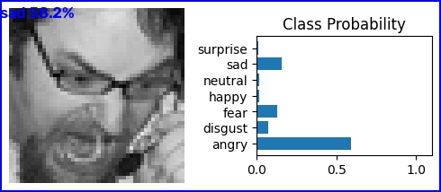

# SOTA-style Facial Expression Recognition



C++ port of the [algo-boyz/sota](https://github.com/algo-boyz/sota) Python demo.

| | Classic LibTorch | **This demo (C++ OpenCV DNN)** |
|--|------------------------|--------------------------------|
| Architecture | VGG19-BN | **MobileFaceNet + Progressive Teacher** |
| Typical accuracy | ~66% (FER-2013) | **~88% (RAF-DB)** |
| Face detection | none (assumes crop) | **YuNet** |
| Runtime | LibTorch | OpenCV DNN (CPU / Apple Silicon) |
| Live webcam | no | **yes** |

Model source: [OpenCV Zoo – facial_expression_recognition](https://huggingface.co/opencv/facial_expression_recognition)

## Requirements (Apple M4 / macOS arm64)

- CMake ≥ 3.16
- C++17 compiler (Apple Clang)
- OpenCV ≥ 4.8 with DNN + FaceDetectorYN  
  ```bash
  brew install opencv cmake
  ```

## Download models ~few MB

```bash
./download_models.sh
```

Files:

- `models/facial_expression_recognition_mobilefacenet_2022july.onnx`
- `models/face_detection_yunet_2023mar.onnx`

## Build

```bash
mkdir -p build && cd build
cmake .. -DCMAKE_BUILD_TYPE=Release
cmake --build . -j$(sysctl -n hw.ncpu)
```

## Run

```bash
# sample images from assets/test/ (happy, sad, ...)
./sota_fer

# single image
./sota_fer --image /path/to/photo.jpg
./sota_fer --image /path/to/photo.jpg --show

# live webcam (q to quit)
./sota_fer --webcam
```

## Emotion labels

`angry · disgust · fearful · happy · neutral · sad · surprised`
